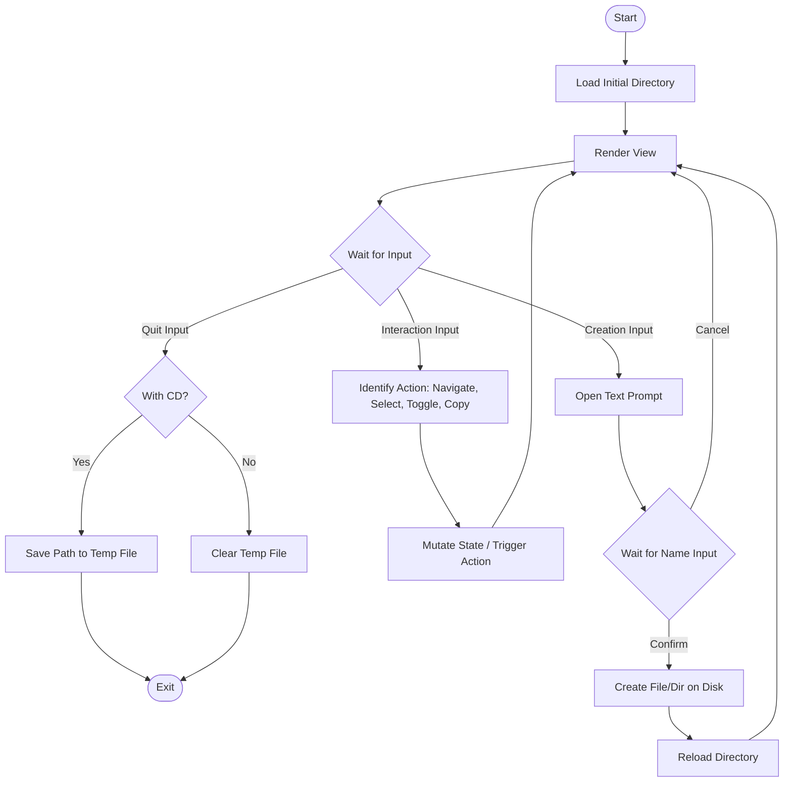

# Logical Workflow Flowchart

Below is the abstract logical flowchart for `fmtui`, organized around Input, Action, and Output/Side-effects.

```mermaid
flowchart TD
    Start([Start]) --> Init[Load Initial Directory]
    Init --> Render[Render View]
    Render --> Loop{Wait for Input}

    %% Quit Flow
    Loop -->|Quit Input| QuitCheck{With CD?}
    QuitCheck -->|Yes| SavePath[Save Path to Temp File] --> Exit([Exit])
    QuitCheck -->|No| ClearTemp[Clear Temp File] --> Exit

    %% Navigation & Interaction Flow
    Loop -->|Interaction Input| ParseAction[Identify Action: Navigate, Select, Toggle, Copy]
    ParseAction --> ApplyState[Mutate State / Trigger Action]
    ApplyState --> Render

    %% Creation Flow
    Loop -->|Creation Input| Prompt[Open Text Prompt]
    Prompt --> InputLoop{Wait for Name Input}
    InputLoop -->|Cancel| Render
    InputLoop -->|Confirm| DiskWrite[Create File/Dir on Disk] --> Reload[Reload Directory] --> Render
```
